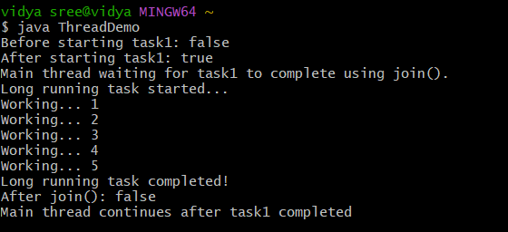

# java-lab-cse-g-5ef-7c
# experiment -7c
# # illustration of isAlive() and join() 
source code : 
```
 class LongRunningTask extends Thread {
    @Override
    public void run() {
        System.out.println("Long running task started...");
        try {
           
            for (int i = 1; i <= 5; i++) {
                System.out.println("Working... " + i);
                Thread.sleep(1000); 
            }
        } catch (InterruptedException e) {
            System.out.println("Task interrupted: " + e);
        }
        System.out.println("Long running task completed!");
    }
}
 public class ThreadDemo {
    public static void main(String[] args) {
       
        LongRunningTask task1 = new LongRunningTask();

      
        System.out.println("Before starting task1: " + task1.isAlive());

       
        task1.start();

        
        System.out.println("After starting task1: " + task1.isAlive());

        System.out.println("Main thread waiting for task1 to complete using join().");
        try {
           
            task1.join();
        } catch (InterruptedException e) {
            System.out.println("Main thread interrupted: " + e);
        }

        
        System.out.println("After join(): " + task1.isAlive());
        System.out.println("Main thread continues after task1 completed");
    }
}
```
# OUTPUT : 

